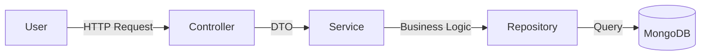

# 📔 Online Diary & Social Platform (Hệ thống Nhật ký Trực tuyến)

> **Mô tả:** Hệ thống kết hợp giữa quản lý nhật ký cá nhân (Personal Information Management) và mạng xã hội thu nhỏ, tập trung vào tính riêng tư và cơ chế phân quyền chia sẻ nội dung chặt chẽ.

---

## 📖 Mục lục
- [Giới thiệu](#-giới-thiệu)
- [Tính năng nổi bật](#-tính-năng-nổi-bật)
- [Kiến trúc hệ thống](#-kiến-trúc-hệ-thống)
- [Thiết kế Cơ sở dữ liệu (NoSQL)](#-thiết-kế-cơ-sở-dữ-liệu-nosql)
- [Cài đặt và Hướng dẫn sử dụng](#-cài-đặt-và-hướng-dẫn-sử-dụng)
- [Công nghệ sử dụng](#-công-nghệ-sử-dụng)
- [Tác giả](#-tác-giả)

---

## 🚀 Giới thiệu

Dự án được xây dựng nhằm giải quyết bài toán: **"Làm thế nào để chia sẻ cảm xúc cá nhân nhưng vẫn giữ quyền kiểm soát tuyệt đối?"**. Khác với Facebook hay Instagram (nơi mặc định là Public/Friends), hệ thống này cho phép người dùng cấu hình chi tiết quyền xem cho *từng bài viết*.

Hệ thống áp dụng kiến trúc **Layered Architecture (MVC + Service)** và cơ sở dữ liệu **MongoDB** để tối ưu hóa hiệu năng đọc (Read-heavy) và khả năng mở rộng.

---

## 🌟 Tính năng nổi bật

### 1. Phân quyền bảo mật 4 cấp độ (Core Feature)
Mỗi bài nhật ký có thể được thiết lập một trong 4 mức độ hiển thị:
* 🔒 **Private:** Chỉ chủ nhân mới được xem.
* 🛡️ **Protected 1 (Whitelist):** Chỉ những bạn bè được chọn đích danh mới được xem.
* 👥 **Protected 2 (Friend-only):** Tất cả bạn bè (đã Accept) đều được xem.
* 🌍 **Public:** Công khai với tất cả mọi người.

### 2. Mạng xã hội & Tương tác
* Gửi lời mời kết bạn (Friend Request), Chấp nhận/Từ chối.
* Bình luận (Comment) trên bài viết (có thể Tắt/Bật tính năng comment cho từng bài).
* Newsfeed tổng hợp bài viết từ bạn bè dựa trên quyền truy cập.

### 3. Cá nhân hóa & Tiện ích (PIM)
* **User Layouts:** Người dùng có thể tùy chỉnh giao diện trang chủ (Bật/Tắt/Sắp xếp các Widget).
* **Work Schedule:** Quản lý lịch làm việc, nhắc nhở sự kiện quan trọng.

---

## 🏗 Kiến trúc hệ thống

Dự án tuân thủ mô hình **MVC kết hợp Service Layer** để đảm bảo nguyên tắc *Separation of Concerns*:

1.  **Presentation Layer (Controller):** Tiếp nhận Request, Validate cơ bản (DTO), trả về Response.
2.  **Business Logic Layer (Service):**
    * Xử lý logic nghiệp vụ phức tạp.
    * Kiểm tra ACL (Access Control List) cho chức năng Protected 1.
    * Quản lý Transaction.
3.  **Data Access Layer (Repository):** Giao tiếp với MongoDB.

## Author: Heizdoobert
